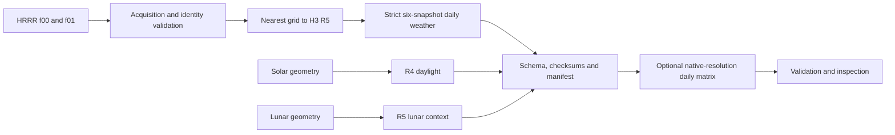

# Reproducible context for environmental modeling

`toolkit-meteorology` creates provenance-aware spatial and temporal meteorological and astronomical data products. It is an independently installable Python package with a `meteorology` command, a small [Python API](reference/api.md), explicit Arrow schemas, and inspectable manifests.

The current weather producer is **retrospective**: six local-day HRRR `sfc/f00` analyses, paired with one-hour-lead `sfc/f01` precipitation-rate forecasts. The precipitation result is an estimate from six snapshots. It is not a measured 24-hour accumulation or a future-weather forecast.

The October 2026 [implementation tracker](IMPLEMENTATION_TRACKER.md) records the corrective patch, separate [hourly H3 family](hourly-weather.md), frozen-reference results, and remaining provider/accuracy gates. Hourly offline product checks do not establish real HRRR compatibility or regional accuracy.

<div class="grid cards" markdown>

- :material-weather-partly-cloudy: **Surface weather**<br>
  Temperature, humidity, vector wind, gusts, visibility, cloud, pressure, and a carefully labeled precipitation estimate at H3 R5.

- :material-clock-outline: **Hourly atmosphere**<br>
  Distinct f00 values at every actual UTC hour and H3 R5 cell from retained decoded source inputs.

- :material-weather-sunny: **Daylight**<br>
  Deterministic solar context at R4, including a compact 365/366-day lookup and explicit polar missingness.

- :material-moon-waning-crescent: **Lunar context**<br>
  Approximate phase, illumination and geometrical moon visibility at R5. Actual surface illumination is outside the method.

- :material-file-check-outline: **Validated releases**<br>
  Checksummed tables and manifests identify software, method, execution and content release independently.

</div>

## First run

```bash
python -m pip install '.[test]'
meteorology --workspace ./demo init
meteorology --workspace ./demo example-offline
meteorology --workspace ./demo validate --daily-matrix ./demo/outputs/synthetic-daily-matrix.parquet
```

The offline example creates labeled **synthetic** HRRR-like inputs and builds the normal support, weather, daylight, lunar and daily-matrix products. It requires a fresh workspace and makes no network requests. See the [quickstart](getting-started/quickstart.md) for a wheel-install example and [acquisition guide](WORKFLOWS.md) before running real HRRR downloads.

## One week of real weather

The [live one-week demo](live-week-demo.md) builds hourly H3 releases and compact
daily/weekly H3 and regional summaries, with explicit transfer budgets, resumption
and resource accounting. Observational accuracy and future forecast skill remain
separate acceptance gates.

## How products flow



Solar and lunar products require H3 support, but no HRRR acquisition. The optional daily matrix retains R4 and R5 rows separately; unsupported component columns remain null.

Weather, daylight and lunar context do not measure species occurrence, observer access, reporting, or detection probability. Read the [scientific methodology](methodology.md) and [limitations](limitations.md) before using these values as predictors.
